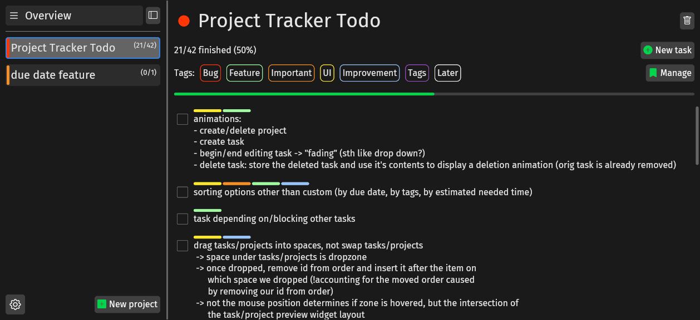
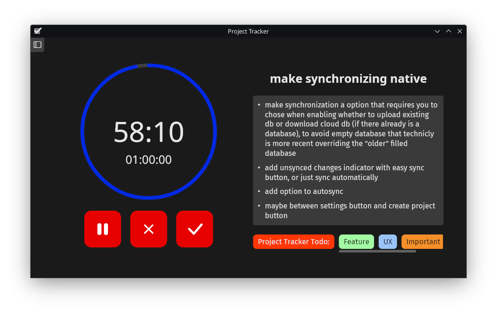

# Project Tracker

personal project todo list tracker

- offline local storage
- synchronize tasks with onedrive, googledrive, etc. through native filesystem (optional)
- synchronize tasks with selfhosted server, includes selfhosted website to view from any device (optional)

## Platform support
| Platform    | GUI/Client | Server | Server (Docker) | Tested |
| ----------- | ---------- | ------ | --------------- | ------ |
| Linux       | ✅         | ✅     | ✅              | ✅     |
| Windows     | ✅         | ❌     | ✅              | ✅     |
| Macos       | ✅         | ❌     | ✅              | ❌     |
| Raspberrypi | ❌         | ✅     | ✅              | ✅     |

## Installation (see [INSTALL.md](INSTALL.md))