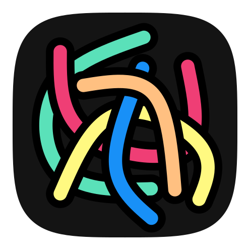

  
  <h1><strong>Project Tracker</strong></h1>
  

    <strong>personal project todo list tracker</strong>
  

  
  
  

## Features
__Functionality:__
- seperate todos into projects, view tasks due of all at once
- create tags for tasks to filter by 'Bug', 'Feature', 'Important', etc.
- choose different colors for projects and tags to quickly overview everything
- document progress on project and time spend on each task
- gain better sense of time to complete a task

__Storage:__
- offline local storage
- synchronize tasks with any network drive (like onedrive, googledrive, selfhosted solutions, etc.) through the native filesystem (optional)
- synchronize tasks with selfhosted server, includes selfhosted website to view from any device (optional)

## Platform support
| Platform    | GUI/Client | Server | Server (Docker) | Tested |
| ----------- | ---------- | ------ | --------------- | ------ |
| Linux       | ✅         | ✅     | ✅              | ✅     |
| Windows     | ✅         | ❌     | ✅              | ✅     |
| Macos       | ✅         | ❌     | ✅              | ❌     |
| Raspberrypi | ❌         | ✅     | ✅              | ✅     |

## Installation (see [INSTALL.md](INSTALL.md))